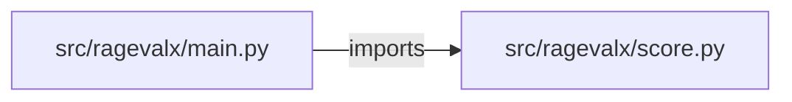

# rag-eval-observability — project architecture

[README](README.md) · [Interview questions and answers](INTERVIEW_QA.md)

## Purpose and scope

Compare chunking, retrieval, and prompts on faithfulness, context precision, answer relevance, latency and cost.

This document describes files and symbols in this checkout. Deployment templates and statements in the original overview are distinguished from a verified running environment.

## Component diagram



For Python repositories, arrows show resolved local imports, not network calls or deployment order. Otherwise the diagram is a repository component map; containment arrows do not assert runtime integration.

## Components and responsibilities

| Component | Responsibility |
| --- | --- |
| [`src/ragevalx/main.py`](src/ragevalx/main.py) | HTTP handlers: `GET /healthz`, `POST /evaluate` |
| [`src/ragevalx/score.py`](src/ragevalx/score.py) | Functions: `words`, `evaluate` |
| [`requirements.txt`](requirements.txt) | Implementation or supporting configuration |
| [`tests/test_eval.py`](tests/test_eval.py) | Executable checks and regression examples |
| [`.github/workflows/ci.yml`](.github/workflows/ci.yml) | GitHub Actions job definitions |
| [`README.md`](README.md) | Project explanations or operating notes |

## Request interface

| Method and path | Handler | Source |
| --- | --- | --- |
| `GET /healthz` | `healthz` | [`src/ragevalx/main.py`](src/ragevalx/main.py#L6) |
| `POST /evaluate` | `post_eval` | [`src/ragevalx/main.py`](src/ragevalx/main.py#L10) |

The table lists literal route decorators found in the inspected Python modules. Router prefixes and middleware can add behavior; check the linked handler and application setup before calling an endpoint.

## Implementation walkthrough

### `evaluate(answer, gold, contexts, latency_ms=10, cost_usd=0.0)`

Source: [`src/ragevalx/score.py`](src/ragevalx/score.py#L7).

Calls visible in this function: `isinstance`, `len`, `max`, `round`, `set`, `set().union`, `words`.

```python
def evaluate(answer, gold, contexts, latency_ms=10, cost_usd=0.0):
    aw, gw = words(answer), words(gold)
    cw = set().union(*(words(c) for c in (contexts if isinstance(contexts, list) else [contexts or ""])))
    faith = len(aw & cw) / len(aw) if aw else 0
    rel = len(aw & gw) / len(gw) if gw else 0
    precision = (1.0 if contexts and len(words(contexts[0] if isinstance(contexts, list) else contexts) & gw) >= max(1, len(gw)//2) else 0.0)
    return {
        "faithfulness": round(faith, 4),
        "answer_relevance": round(rel, 4),
        "context_precision": precision,
        "latency_ms": latency_ms,
        "cost_usd": cost_usd,
        "passed": faith >= 0.5 and rel >= 0.5,
        "trace_id": "tr-local",
    }
```

### `words(t)`

Source: [`src/ragevalx/score.py`](src/ragevalx/score.py#L4).

Calls visible in this function: `(t or '').lower`, `re.findall`, `set`.

```python
def words(t):
    return set(re.findall(r"[a-z0-9]+", (t or "").lower())) - STOP
```

## Data and state

- [`src/ragevalx/score.py`](src/ragevalx/score.py) defines module-level containers: `STOP`.

Module-level dictionaries/lists live in a Python process. They can be fixtures or mutable state; inspect writes before treating them as persistent storage. A production extension would need to define persistence and concurrency behavior explicitly.

## Data flow and design decisions

### What is the input-to-output contract of `evaluate`

In [`src/ragevalx/score.py`](src/ragevalx/score.py#L7), `evaluate(answer, gold, contexts, latency_ms=10, cost_usd=0.0)` receives the inputs. The function computes these intermediate values:

- `aw, gw = (words(answer), words(gold))`
- `cw = set().union(*(words(c) for c in (contexts if isinstance(contexts, list) else [contexts or ''])))`
- `faith = len(aw & cw) / len(aw) if aw else 0`
- `rel = len(aw & gw) / len(gw) if gw else 0`
- `precision = 1.0 if contexts and len(words(contexts[0] if isinstance(contexts, list) else contexts) & gw) >= max(1, len(gw) // 2) else 0.0`

Its result is defined by:

- `{'faithfulness': round(faith, 4), 'answer_relevance': round(rel, 4), 'context_precision': precision, 'latency_ms': latency_ms, 'cost_usd': cost_usd, 'passed': faith >= 0.5 and rel >= 0.5, 'trace_id': 'tr-local'}`

## Setup and verification

The following commands are derived from the checked-in dependency/test contracts. Execute them from the repository root; the block prepares a local environment, not a cloud deployment.

```bash
python3 -m venv .venv
source .venv/bin/activate
python -m pip install -r requirements.txt
python -m pytest -q
```

Python dependencies: [`requirements.txt`](requirements.txt).

Test entry points: [`tests/test_eval.py`](tests/test_eval.py).

Automation definitions: [`.github/workflows/ci.yml`](.github/workflows/ci.yml). Read their triggers and job steps to determine what CI actually runs.

## Operating boundaries and design review

Before turning this checkout into a customer deployment, establish the input contract, data ownership, access controls, failure response, evaluation criteria, and rollback owner. Repository fixtures and unit tests demonstrate local behavior; they do not establish throughput, uptime, compliance, or business impact.

A useful architecture review starts with the linked implementation: identify where input enters, where a decision is made, which state can change, and which external dependency can fail. Add a deployment view only for infrastructure that is actually configured and exercised.
